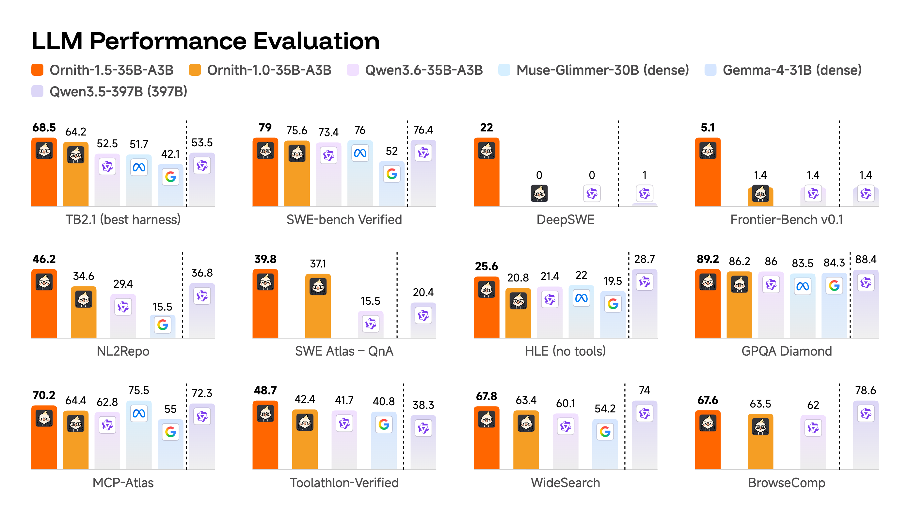

# NVMAI

## Ornith 1.5 Roadmap

> [!IMPORTANT]
> NVMAI v4.0 plans to adopt **Ornith-1.5-35B-A3B** as its next default model.
> Qwen 3.6 35B-A3B remains the supported model until the Ornith integration is
> implemented, validated, and benchmarked.

Ornith is a 35B mixture-of-experts model with approximately 3B active
parameters per token. The chart above is publisher-supplied, not an NVMAI
measurement. See the [Ornith 1.5 announcement](https://ornith.ai/ornith_1_5.html)
and [model card](https://huggingface.co/ornith-ai/Ornith-1.5-35B-A3B).

## Benchmarks

Base M3 MacBook Pro, 24 GB, 30-request coding workload, 4K context, prompt
cache off, temperature `0.2`, Top-K `64`, and Top-P `0.95`:

| Quantization | Decode | End-to-end output | Mean TTFT |
| --- | ---: | ---: | ---: |
| 4-bit | 12.41 tok/s | 7.57 tok/s | 4.59 s |
| 6-bit (legacy) | 6.99 tok/s | 4.11 tok/s | 7.35 s |

Six-bit is retained here as a historical comparison; support was withdrawn in
3.9. Current installations use 4-bit or 8-bit. Results depend on hardware,
prompt, storage, and system load. See the [full benchmark notes](https://github.com/Pummelchen/NVMAI/wiki/Benchmarks).

## Core Links

- [Getting started](https://github.com/Pummelchen/NVMAI/wiki/Getting-Started)
- [Features](https://github.com/Pummelchen/NVMAI/wiki/Features)
- [Local server and launchers](https://github.com/Pummelchen/NVMAI/wiki/OpenAI-Compatible-Server)
- [Runtime controls](https://github.com/Pummelchen/NVMAI/wiki/Runtime-Controls)
- [Benchmarks](https://github.com/Pummelchen/NVMAI/wiki/Benchmarks)
- [Changelog](https://github.com/Pummelchen/NVMAI/wiki/Changelog)

## Credits

NVMAI is a focused fork of
[drumih/turbo-fieldfare](https://github.com/drumih/turbo-fieldfare), which
provides the bounded-memory runtime, installer, CLI, Mac app, and local server.
The Qwen 3.6 integration was created by
[NeelM0906](https://github.com/NeelM0906) in
[upstream PR #29](https://github.com/drumih/turbo-fieldfare/pull/29). Concise
mode is derived from the
[Nail-Qwen3.6-35B-A3B](https://huggingface.co/peculiar-ragdoll/Nail-Qwen3.6-35B-A3B-MLX)
chat template by [peculiar-ragdoll](https://huggingface.co/peculiar-ragdoll).
